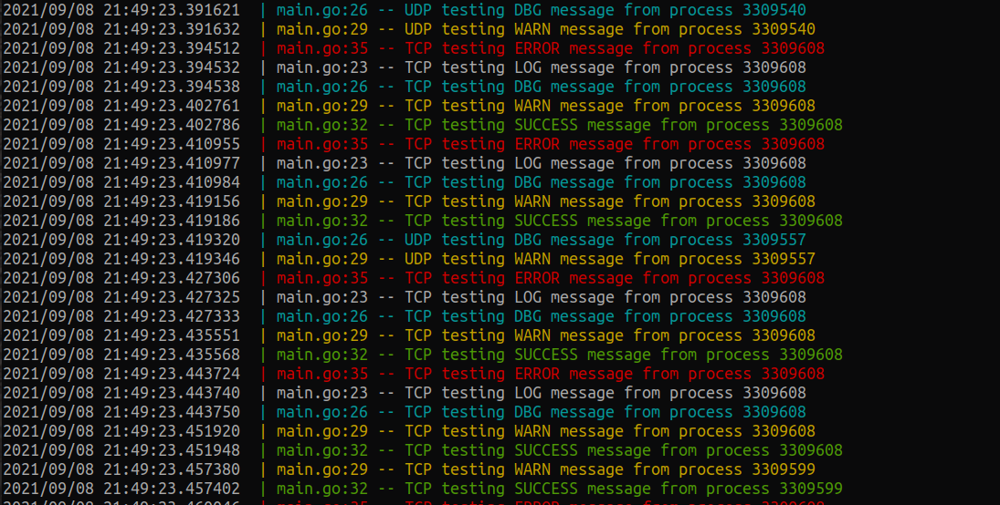

[](https://github.com/Ryan-Johnson-1315/socketlogger/actions/workflows/go.yml)
[](https://coveralls.io/github/Ryan-Johnson-1315/socketlogger?branch=master)
# socketlogger
`socketlogger` is a language agnostic logging utility designed to allow mulitple applications, running on one or multiple computers, to write log messages to a one console screen and (if enabled) one common log file. This utility produces one common log file, eliminating the need to collect and combine multiple log files. `socketlogger` also includes a CSV server, allowing multiple processes to create `.csv` files on a master computer for easy data post processing.


## How it works
Using JSON, log messages are formatted and sent over network sockets. A server will parse the log messages and write messages to the log file. Applications need only a UDP/TCP socket to implement logs.

This utility is developed entirely in [Go](https://golang.org/). Go allows [cross compilation](https://opensource.com/article/21/1/go-cross-compiling) "out of the box". This gives developers the option of creating a standalone commandline application for varying architecture's.

Available Log Levels
- 0 -> Log (white)
- 1 -> Warn (yellow)
- 2 -> Success (green)
- 3 -> Error (red)
- 4 -> Debug (cyan)

```
{
  "caller": "video.py:85",
  "level": 0,
  "message": "grabbing frames at 25 fps"
}
```
Will produce this message:
```
$ 2021/09/14 21:14:51 | video.py:85 -- grabbing frames at 25 fps
```

CSV Message Format

```
{
  "caller": "DataCollector.java:512"
  "rows": ["id", "first_name", "last_name", "email", "gender", "zip_code"]
  "csv_filename": "data_collection.csv"
}
```
Will create the file named `data_collection.csv`
```
{
  "caller": "DataCollector.java:542"
  "row": [1, "Rolf", "Kleinfeld", "rkleinfeld0@dell.com", "male", 72113]
  "csv_filename": "data_collection.csv"
}
```
Will append to the csv file with the rows specified
## Standalone Application
1. Install [Go](https://golang.org/dl/)
2. `mkdir logger`
3. `git clone https://github.com/Ryan-Johnson-1315/socketlogger.git`
4. `cd socketlogger/server`
5. `go build -o server .`
6. `./server --help`


## Go Examples
`import "github.com/Ryan-Johnson-1315/socketlogger"`

### Logger Server
```
func main() {
  // Set up the UDP server to listen for messages
  udp := socketlogger.NewUdpLoggerServer()

  // Set the log directory and filename. Directory will be created
  // if non existent
  now := time.Now().Format("2006-01-02T15:04:05")
  udp.SetLogFile("log-files", now + ".log")

  // Set the log flags
  udp.SetTimeFlags(log.Ldate | log.Ltime | log.Lmicroseconds)

  // Start the server and listen for messages
  udp.Bind(socketlogger.Connection{
    Addr: "127.0.0.1",
    Port: 40000,
  })

  // Set up the TCP server to listen for messages
  tcp := socketlogger.NewTcpLoggerServer()

  // Output to the same log file and UDP server
  tcp.SetLogFile("log-files", now + ".log")

  // Set the log flags
  tcp.SetTimeFlags(log.Ldate | log.Ltime | log.Lmicroseconds)

  // Start the server and listen for messages
  tcp.Bind(socketlogger.Connection{
    Addr: "127.0.0.1",
    Port: 40001,
  })

  // Wait for ^C signal, then shutdown the servers
  quit := make(chan os.Signal, 2)
  signal.Notify(quit, os.Interrupt, syscall.SIGTERM)
  <-quit

  // Ensure that all of the messages get written to log file
  udp.Shutdown()
  tcp.Shutdown()
}
```
After the logger has been shutdown, log file will be written to `log-files` directory
```
├── log-files
│   └── 2021-09-13T21:41:11.log
├── go.mod
├── go.sum
└── main.go
```
### CSV Server
```
func main() {
  dir := "csv-files"

  // Set up the UDP server to listen for messages
  udp := socketlogger.NewUdpCsvServer()

  // Set the of the csv files 
  udp.SetOutputCsvDirectory(dir)

  // Start the server and listen for messages
  udp.Bind(socketlogger.Connection{
    Addr: "127.0.0.1",
    Port: 50000,
  })

  // Set up the TCP server to listen for messages
  tcp := socketlogger.NewTcpCsvServer()

  // Set the of the csv files 
  tcp.SetOutputCsvDirectory(dir)

  // Start the server and listen for messages
  tcp.Bind(socketlogger.Connection{
    Addr: "127.0.0.1",
    Port: 50001,
  })

  // Wait for ^C signal, then shutdown the servers
  quit := make(chan os.Signal, 2)
  signal.Notify(quit, os.Interrupt, syscall.SIGTERM)
  <-quit

  // Ensure that all of the messages get written to csv file
  udp.Shutdown()
  tcp.Shutdown()
}
```
After the csv servers have shut down the following files will be made:
```
├── csv-files
│   ├── class_2019.csv
│   └── class_2020.csv
├── go.mod
├── go.sum
└── main.go
```

### Native logging
To set up a native application to use the socket logger, developers need to only call `log.SetOutput`. This allows you to update legacy code that is using the `log` package to send all log messages to the server.

```
// Set up the connection to the server. Can be UDP/TCP
logger := socketlogger.NewUdpLoggerClient()
logger.Connect(socketlogger.Connection{
  Addr: "127.0.0.1",
  Port: 0,
}, socketlogger.Connection{
  Addr: "127.0.0.1",
  Port: 40000,
})

// Setting the output will send all log messages to the serveer
log.SetOutput(logger)
// Setting this will format the message to conform to other socketlogger messages
log.SetFlags(socketlogger.EmbeddedFlags)
// Makes sure all of the messages get written over the socket
logger.Disconnect()
```
Doing this allows all other `log` function calls to be sent to the server. 

To keep the console output as well as sending to the server, add an instance of `io.MultiWriter` as the output of the logger
```
log.SetOutput(io.MultiWriter(logger, os.StdOut))
```

See `socketlogger/examples` for GoLang and other language client implementations